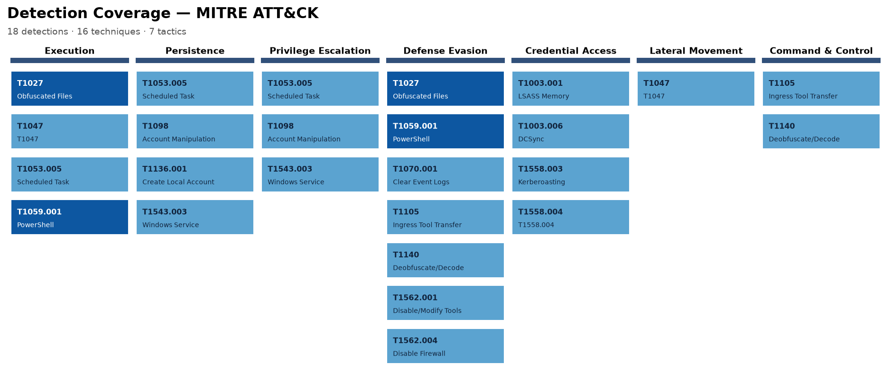

# Detection Engineering — Detection-as-Code

> Threat-detection rules with automated tests, CI, and ATT&CK coverage tracking.
> Every Sigma rule ships with fixtures proving it fires on the attack and stays
> silent on benign activity. CI re-runs everything on every commit.

**[🔎 Live dashboard →](https://canmenzo.github.io/detection-engineering/)** — browsable, filterable view of every detection and its test status.



## Why this exists

Most "detection work" lives in a SIEM console and disappears when you log out.
This repo treats detections like software: version-controlled rules, unit tests
against real adversary telemetry, CI/CD, and an auto-generated coverage map — so
a detection is only "done" when it's tested, mapped, and merged.

## How it works

```
 Sigma rule (YAML)
        │
        ├── validate_metadata.py ── every rule needs an ATT&CK tag + a fixture, or CI fails
        │
        ├── sigma convert ──────── valid KQL (Sentinel) and SPL (Splunk) or CI fails
        │
        ├── Hayabusa + pytest ──── TP fixture must fire, benign fixture must not
        │
        └── coverage map ───────── coverage.png matrix + ATT&CK Navigator layer
```

## Run it locally

```bash
python -m venv .venv && .venv\Scripts\activate   # Windows
pip install -r requirements.txt

python tools/validate_metadata.py          # metadata + fixture discipline
python tools/generate_coverage_png.py      # writes coverage/coverage.png
python tools/generate_navigator_layer.py   # writes coverage/navigator_layer.json
python tools/generate_dashboard.py         # writes site/index.html (the live dashboard)
pytest -v                                   # fetches pinned samples, runs Hayabusa
```

Hayabusa is a single binary from [Yamato Security](https://github.com/Yamato-Security/hayabusa);
download a release and point `HAYABUSA_BIN` at it (keep it next to its bundled
`rules/config`). Tests download pinned public EVTX samples on first run and cache
them locally — see [`docs/adr/0002`](docs/adr/0002-fetch-pinned-samples.md).

## The detection lifecycle

Hypothesis → Sigma rule → EVTX fixtures (TP + benign) → tested with Hayabusa →
converted to KQL/SPL → mapped to ATT&CK → shipped via PR.
Full walkthrough in [`docs/detection_lifecycle.md`](docs/detection_lifecycle.md).

## Coverage

The matrix at the top is rendered directly from the rule corpus by
[`tools/generate_coverage_png.py`](tools/generate_coverage_png.py) — no external
service needed; it regenerates on every commit.

For an interactive view, [`coverage/navigator_layer.json`](coverage/navigator_layer.json)
can be loaded in the [ATT&CK Navigator](https://mitre-attack.github.io/attack-navigator/)
("Open Existing Layer" → "Upload from local"). The layer pins `attack: 16`; if the
hosted Navigator has moved to a newer ATT&CK release it may refuse the file, which
is why the committed PNG above is the canonical, dependency-free view.
