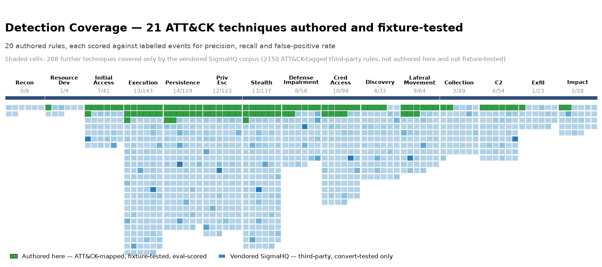

# Detection Engineering — Detection-as-Code

> Threat-detection rules that are **measured**, not just written. Every rule is
> scored for precision, recall and false-positive rate against labelled events,
> tested against real adversary telemetry, and blocked from merging if it drops
> below a threshold it declares for itself.

**[🔎 Live dashboard →](https://canmenzo.github.io/detection-engineering/)** — every
detection, its scores and its test status. Hover any number for how it was calculated.
**[📖 How it works →](https://canmenzo.github.io/detection-engineering/about.html)** —
the full method, written for a reader with no security background as well as one with.



## In short

- **15 Sigma rules**, each ATT&CK-mapped, each proven to fire on a pinned public
  EVTX capture of the real attack, each scored against hand-labelled benign
  look-alikes.
- **Two independent engines** check every rule — Hayabusa over real EVTX, a SQL
  evaluator over labelled events. They must agree; disagreement fails the build.
- **Every rule declares the score it must hit.** CI fails when one drops below its
  own bar, and a lowered bar is rejected unless it carries a written justification.
- **Every published number is generated**, then rebuilt in CI and diffed against
  what is committed — including the unflattering ones, and including this file.

One command reproduces all of it from a clean checkout:

```bash
uv sync --all-extras && uv run detkit ci      # ~20s, the same sequence CI runs
```

## Detection quality

Read **FP rate** first: it is the share of benign events that alerted, and unlike
precision it cannot be improved by writing more attack cases. Precision moves with
the malicious-to-benign ratio of the case set, which is authored here, not observed.

<!-- detkit:eval-table:start -->

15 rules, 125 labelled events. Generated by `detkit eval`; CI fails if this table drifts from the corpus.

| rule | level | precision | recall | FP rate | bar it must clear |
|---|---|---:|---:|---:|---|
| `proc_creation_win_impacket_wmiexec_output` | high | 1.00 | 1.00 | 0.00 | p≥0.90, r≥1.00, fp≤0.10 |
| `security_win_dcsync_replication` | critical | 1.00 | 1.00 | 0.00 | p≥0.90, r≥1.00, fp≤0.10 |
| `security_win_service_installed` | high | 1.00 | 1.00 | 0.00 | p≥0.90, r≥1.00, fp≤0.10 |
| `proc_creation_win_encoded_powershell` | high | 0.83 | 1.00 | 0.14 | p≥0.80, r≥1.00, fp≤0.20 |
| `proc_creation_win_firewall_disabled_netsh` | high | 0.75 | 1.00 | 0.14 | p≥0.70, r≥1.00, fp≤0.20 |
| `security_win_kerberoasting_rc4_request` | high | 0.75 | 1.00 | 0.17 | p≥0.70, r≥1.00, fp≤0.25 |
| `sysmon_proc_access_lsass_dump` | high | 0.80 | 1.00 | 0.20 | p≥0.75, r≥1.00, fp≤0.25 |
| `security_win_asrep_roasting` | high | 0.75 | 1.00 | 0.25 | p≥0.70, r≥1.00, fp≤0.30 |
| `security_win_scheduled_task_created` | high | 0.75 | 1.00 | 0.25 | p≥0.70, r≥1.00, fp≤0.30 |
| `proc_creation_win_certutil_download_decode` | high | 0.67 | 1.00 | 0.33 | p≥0.60, r≥1.00, fp≤0.40 |
| `posh_ps_defender_tamper` | high | 0.71 | 1.00 | 0.40 | p≥0.65, r≥1.00, fp≤0.45 |
| `security_win_user_added_to_privileged_group` | high | 0.60 | 1.00 | 0.50 | p≥0.55, r≥1.00, fp≤0.55 |
| `posh_ps_susp_encoded_powershell_scriptblock` | informational | 0.50 | 1.00 | 0.67 | p≥0.45, r≥1.00, fp≤0.70 |
| `security_win_eventlog_cleared` | high | 0.60 | 1.00 | **1.00** | p≥0.55, r≥1.00, fp≤1.00 |
| `security_win_local_user_created` | informational | 0.43 | 1.00 | **1.00** | p≥0.40, r≥1.00, fp≤1.00 |

<!-- detkit:eval-table:end -->

Called out rather than buried:

- **Two rules still alert on 100% of benign events.** `security_win_eventlog_cleared`
  keeps that bar deliberately — a cleared log carries no evidence of *why*, so no
  discriminator exists, and the argument for shipping it anyway is the base rate.
  `security_win_local_user_created` cannot make that argument, so it is demoted to an
  audit record. Both justifications live in their case files.
- **Two rules that did have signal were fixed rather than excused.**
  `security_win_service_installed` went from 0.43 precision / 1.00 FP rate to
  **1.00 / 0.00**, and `security_win_scheduled_task_created` to **0.75 / 0.25**, by
  keying on what the service or task actually executes.
- **Measurement found a real evasion.** `powershell.exe` accepts `-e` as an
  abbreviation of `-EncodedCommand`; the rule tested only the longer spellings.
  Closing it took recall from 0.80 to 1.00 at the cost of one false positive in
  seven — a trade the harness refused to accept until it was written down.

## Known limits

- **The benign events are authored, not captured.** They prove a rule's logic
  discriminates; they say nothing about alert volume on a live estate.
- **Sentinel coverage is partial, and it is a platform limit.** Splunk gets all 15
  rules, source-bound. Microsoft XDR gets the `process_creation` subset —
  Sentinel's `SecurityEvent` table has no `PreAuthType` column, so the Kerberos
  rules cannot bind there without per-rule `EventData` parsing.
- **Nothing here provisions a SIEM.** Rules compile to deployable, source-bound
  queries; running them in a real estate is out of scope. See
  [ADR 0004](docs/adr/0004-no-terraform.md) on why there is no Terraform.

## Two tiers, never conflated

`detections/` is my own work and carries every gate. `vendored/` is a pinned,
attributed copy of the public [SigmaHQ](https://github.com/SigmaHQ/sigma) Windows
corpus (~2,400 rules, DRL 1.1) — **not my work**, held to none of those gates. It
runs through the same conversion pipeline at scale and shades the coverage map
blue; green cells are authored. The headline number is the green one.

## Running individual steps

```bash
uv run detkit validate        # metadata + fixture + ATT&CK tag discipline
uv run detkit eval            # precision / recall / FP rate per rule
uv run detkit convert         # compile to Splunk + XDR, check every query is bound
uv run detkit probe <rule>    # run a rule against its pinned EVTX and show the hits
uv run detkit dashboard       # rebuild site/index.html + site/about.html
uv run pytest -v              # unit + detection tests (fetches samples, runs Hayabusa)
```

`detkit ci` installs the Hayabusa release pinned in `.hayabusa-version`, verified
against its recorded SHA-256 — an unverified binary download is not a reproducible
build. Locally, without Hayabusa, the detection tests skip so you can still work on
the tooling; CI sets `DETKIT_REQUIRE_HAYABUSA=1`, which turns any skip into a
failure. A detection suite that did not execute must never report green.

## More

- **[How it works](https://canmenzo.github.io/detection-engineering/about.html)** —
  the pipeline, both test layers, every metric and what it hides, all the CI gates,
  and the objections this invites.
- [`docs/detection_lifecycle.md`](docs/detection_lifecycle.md) — hypothesis → rule →
  fixtures → tests → conversion → ATT&CK → ship.
- [`docs/adr/`](docs/adr/) — the architecture decisions, including the rejected options.
- [`coverage/navigator_layer.json`](coverage/navigator_layer.json) — loadable in the
  [ATT&CK Navigator](https://mitre-attack.github.io/attack-navigator/) ("Open Existing
  Layer" → "Upload from local").
